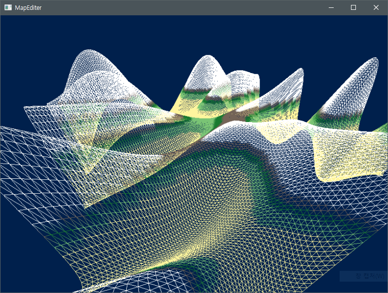

# MapEditer Project
### DirectX 11과 Window Api를 이용한 맵 에디터 프로젝트입니다.

[플레이 영상](https://www.youtube.com/watch?v=Sk9OPXS2uto&t=52s)  

#### MapEditer 클래스 구현
- 윈도우 초기화.
- DirectX 초기화 및 세팅
- 메시지 핸들링

#### MapEditer 내부 클래스 구현
- Timer : 기존에 사용하던 Timer 클래스
- InputLayer : 기존에 구현했던 입력 처리 클래스.
- Camera : http://www.aladin.co.kr/shop/wproduct.aspx?ItemId=31922190 의 카메라 클래스 참조.
- GeometryGenerator : 위와 동일.

메시 데이터를 만들고 높이에 따른 색상 구현.  
카메라 이동 구현.
